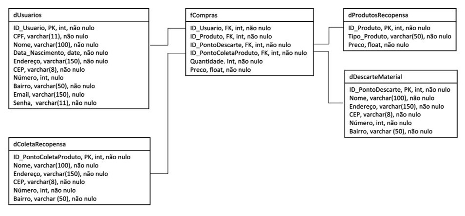

# Projeto: Revolução Verde

## Descrição
O projeto "Revolução Verde" visa reduzir o desperdício, minimizando a quantidade de resíduos enviados para aterros sanitários, contribuindo para a preservação dos recursos naturais e a redução da poluição. Além disso, busca promover a gestão de resíduos, implementando um sistema de coleta seletiva eficiente que envolve toda a comunidade local e educa os moradores sobre a importância da separação adequada de resíduos.

## Tecnologias Utilizadas
- JavaScript
- HTML
- CSS
- Bootstrap

## Como Usar
**Atenção:** O projeto ainda não está completo, mas já possui uma funcionalidade de simulação.

1. Abra o arquivo `index.html` em seu navegador.
2. Na página, você encontrará uma simulação para inserir a quantidade de litros de óleo.
3. Após inserir a quantidade, clique no botão correspondente.
4. O cálculo será feito automaticamente e a quantidade de moedas será atualizada no local da respectiva moeda.
5. Use as moedas acumuladas para comprar barras de sabão ou sabão líquido.

## Contribuição
Atualmente, não estamos aceitando contribuições externas, pois o projeto ainda está em desenvolvimento inicial.

## Atualizações Futuras
Estamos planejando implementar as seguintes melhorias no projeto no futuro:

- Procurar empresas e voluntários para inserir sistema de sensores em cestos para detectar a quantidade de lixo jogado.
- Integração dos sensores com a plataforma para registrar automaticamente a quantidade de resíduos descartados por usuário.
- Criação de um banco de dados para armazenar informações de usuário, incluindo a contagem de moedas e estatísticas de reciclagem.

- Implementação de um sistema de registro de usuários na plataforma.
- Expansão das funcionalidades para incluir um sistema de recompensas com base na reciclagem.

Fique atento para essas emocionantes atualizações que estão por vir na Revolução Verde!

## Licença
Este projeto está sob a [sua licença aqui]. (Substitua com a licença adequada)

## Contato
Para entrar em contato conosco ou obter mais informações sobre o projeto, você pode enviar um e-mail para guilhermenunes08925@gmail.com

## Notas Adicionais
- Certifique-se de verificar regularmente o projeto para atualizações e melhorias.
- Agradecemos por se juntar à Revolução Verde e por ajudar a tornar o mundo um lugar mais limpo e sustentável!